# Tugas Praktikum 2 DPBO 2526 C2 (TP2DPBO2526C2)
Sistem Manajemen Data Film Bioskop dengan Multilevel Inheritance dalam C++, Java, Python, dan PHP.

---

## Janji

> Saya Muhammad Zidan Mirza Fedrieka dengan NIM 2507692 mengerjakan Tugas Praktikum 2 dalam mata kuliah Desain Pemrograman Berorientasi Objek untuk keberkahan-Nya maka saya tidak melakukan kecurangan seperti yang telah dispesifikasikan. Aamiin.

---

## Penjelasan Desain dan Kode (Flow Kode)

### 1. Desain Class dan Multilevel Inheritance

Program menggunakan tiga class dengan hubungan pewarisan bertingkat berikut:

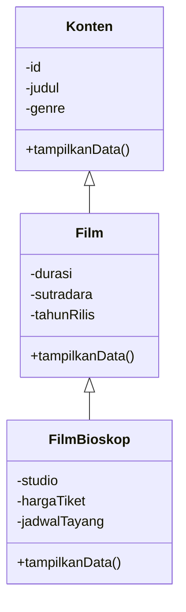

#### Class `Konten`

Class dasar yang menyimpan informasi umum konten/film.

**Atribut:**
- `id` (`int`): Identitas unik film.
- `judul` (`string`): Judul film.
- `genre` (`string`): Genre film.

**Method:**
- `Konten()` / `__construct()`: Constructor (default & parameterized) untuk menginisialisasi atribut `id`, `judul`, dan `genre`.
- `getId()`: Mengembalikan nilai `id` film.
- `setId(id)`: Mengubah nilai `id` film.
- `getJudul()`: Mengembalikan nilai `judul` film.
- `setJudul(judul)`: Mengubah nilai `judul` film.
- `getGenre()`: Mengembalikan nilai `genre` film.
- `setGenre(genre)`: Mengubah nilai `genre` film.
- `tampilkanData()`: Menampilkan data dasar film (`id`, `judul`, `genre`).

#### Class `Film extends Konten`

Class turunan pertama yang menambahkan informasi khusus mengenai film.

**Atribut:**
- `durasi` (`int`): Durasi film dalam satuan menit.
- `sutradara` (`string`): Nama sutradara film.
- `tahunRilis` (`int`): Tahun rilis film.

**Method:**
- `Film()` / `__construct()`: Constructor (default & parameterized) yang memanggil constructor `Konten` serta menginisialisasi atribut `durasi`, `sutradara`, dan `tahunRilis`.
- `getDurasi()`: Mengembalikan nilai `durasi` film.
- `setDurasi(durasi)`: Mengubah nilai `durasi` film.
- `getSutradara()`: Mengembalikan nama `sutradara` film.
- `setSutradara(sutradara)`: Mengubah nama `sutradara` film.
- `getTahunRilis()`: Mengembalikan `tahunRilis` film.
- `setTahunRilis(tahunRilis)`: Mengubah `tahunRilis` film.
- `tampilkanData()`: Override method untuk menampilkan data dari `Konten` ditambah atribut khusus `Film` (`durasi`, `sutradara`, `tahunRilis`).

#### Class `FilmBioskop extends Film`

Class turunan kedua yang menambahkan informasi penayangan film di bioskop.

**Atribut:**
- `studio` (`string`): Nomor atau nama studio penayangan.
- `hargaTiket` (`double`/`float`): Harga tiket penayangan film dalam rupiah.
- `jadwalTayang` (`string`): Waktu/jadwal penayangan film.
- `gambar` (`string`, khusus PHP): Path/lokasi file poster film.

**Method:**
- `FilmBioskop()` / `__construct()`: Constructor (default & parameterized) yang memanggil constructor `Film` serta menginisialisasi atribut `studio`, `hargaTiket`, `jadwalTayang` (dan `gambar` pada PHP).
- `getStudio()`: Mengembalikan nama/nomor `studio`.
- `setStudio(studio)`: Mengubah nama/nomor `studio`.
- `getHargaTiket()`: Mengembalikan `hargaTiket` film.
- `setHargaTiket(hargaTiket)`: Mengubah `hargaTiket` film.
- `getJadwalTayang()`: Mengembalikan `jadwalTayang` film.
- `setJadwalTayang(jadwalTayang)`: Mengubah `jadwalTayang` film.
- `getGambar()` (khusus PHP): Mengembalikan path/lokasi file poster film.
- `setGambar(gambar)` (khusus PHP): Mengubah path/lokasi file poster film.
- `tampilkanData()`: Override method untuk menampilkan seluruh data dari `Film` ditambah data penayangan bioskop (`studio`, `hargaTiket`, `jadwalTayang`, dan `gambar` pada PHP).

### 2. Struktur File

```text
TP2DPBO2526C2/
│   .gitignore
│   README.md
│   
├───CPP
│       Film.cpp
│       FilmBioskop.cpp
│       Konten.cpp
│       main.cpp
│       testcase.txt
│       
├───Dokumentasi
│   ├───CPP
│   │       eror_handling_id_cpp.png
│   │       eror_handling_input_cpp.png
│   │       program_cpp.png
│   │       
│   ├───Java
│   │       eror_handling_id_java.png
│   │       eror_handling_input_java.png
│   │       program_java.png
│   │       
│   ├───PHP
│   │       dashboard_php.png
│   │       eror_handling_id_php(2).png
│   │       eror_handling_id_php.png
│   │       eror_handling_input_php.png
│   │       input_data_berhasil_php.png
│   │       input_data_php.png
│   │       
│   └───Python
│           eror_handling_id_py.png
│           eror_handling_input_py.png
│           program_py.png
│           
├───Java
│       Film.java
│       FilmBioskop.java
│       Konten.java
│       Main.java
│       testcase.txt
│       
├───PHP
│   │   Film.php
│   │   FilmBioskop.php
│   │   index.php
│   │   Konten.php
│   │   testcase.txt
│   │   
│   └───images
│           
└───Python
        Film.py
        FilmBioskop.py
        Konten.py
        main.py
        testcase.txt
```

### 3. Data Awal

Setiap implementasi membuat lima objek awal `FilmBioskop`:

1. Interstellar
2. Inception
3. Avengers: Doomsday
4. Agak Laen 2
5. Merah Putih One For All

PHP menampilkan poster dari folder `PHP/images` dan menyediakan upload poster baru melalui form Bootstrap.

### 4. Alur Eksekusi Program

1. Program membuat lima objek film awal.
2. Seluruh data awal ditampilkan.
3. Program menerima data film baru sesuai urutan testcase.
4. Program memvalidasi data kosong, angka, dan ID duplikat.
5. Jika valid, objek `FilmBioskop` baru ditambahkan ke list, vector, `ArrayList`, atau array.
6. Seluruh data ditampilkan kembali setelah penambahan.

Pada PHP, alur input dilakukan melalui form HTML berbasis Bootstrap. Poster yang diunggah divalidasi, disimpan ke `PHP/images`, dan path-nya disimpan pada atribut `gambar`.

---

## Fitur Program

- Membuat lima data awal film bioskop.
- Menampilkan seluruh atribut dari `Konten`, `Film`, dan `FilmBioskop`.
- Menambah satu data film baru.
- Menolak ID yang sudah digunakan.
- Memvalidasi judul, genre, sutradara, studio, dan jadwal tayang.
- Memvalidasi durasi, tahun rilis, dan harga tiket.
- Menerima teks yang memiliki spasi.
- Menampilkan poster pada implementasi PHP.
- Mengunggah poster baru pada form PHP dengan format JPG, PNG, atau WebP.

## Cara Menjalankan Program

### 1. Persiapan

Pastikan compiler atau interpreter berikut sudah tersedia:

- `g++` untuk C++.
- `javac` dan `java` untuk Java.
- `python` atau `py` untuk Python.
- `php` untuk PHP.

### 2. C++

```bash
cd CPP
g++ main.cpp -o main.exe
main.exe < testcase.txt
```

Pada PowerShell, gunakan `Get-Content testcase.txt | .\main.exe` karena operator `<` tidak digunakan untuk redirection input.

### 3. Java

```bash
cd Java
javac *.java
java Main < testcase.txt
```

### 4. Python

```bash
cd Python
python main.py < testcase.txt
```

### 5. PHP

```bash
cd PHP
php -S localhost:8000
```
Buka `http://localhost:8000` pada browser. Form PHP menerima semua atribut film dan satu file poster untuk data baru.

## Penjelasan Error Handling

1. **ID duplikat** diperiksa dengan menelusuri seluruh data film sebelum objek baru ditambahkan.
2. **Input teks kosong** ditolak pada C++, Java, Python, dan PHP.
3. **Durasi dan tahun rilis** harus lebih besar dari nol.
4. **Harga tiket** tidak boleh bernilai negatif.
5. **C++** menggunakan `cin.ignore()` sebelum membaca teks dengan `getline()`.
6. **Java** menggunakan `Scanner` untuk membaca data sesuai urutan testcase.
7. **Python** menangani kesalahan konversi angka dengan `try-except`.
8. **PHP** memeriksa status upload, tipe MIME gambar, dan keberhasilan penyimpanan file poster.

## Format Testcase

Setiap folder bahasa memiliki `testcase.txt` dengan urutan input berikut:

```text
101
Dune Part Two
Sci-Fi
166
Denis Villeneuve
2024
Studio 6
50000
19:30
```

Urutan tersebut adalah ID, judul, genre, durasi, sutradara, tahun rilis, studio, harga tiket, dan jadwal tayang.

## Dokumentasi Program

### C++
#### 1. Tampilkan Data Film dan Tambahkan Data
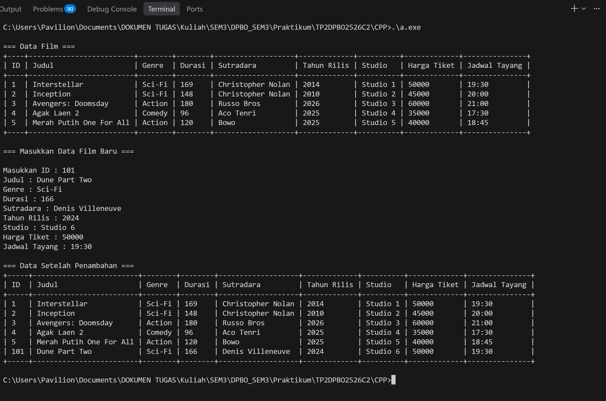

---

#### 2. Eror Handling ID Film
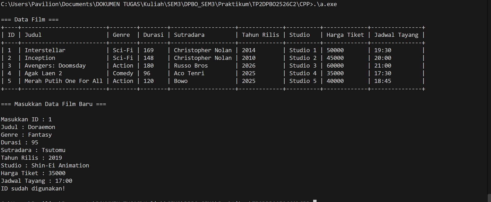

---

#### 3. Eror Handling Input (Input Salah)
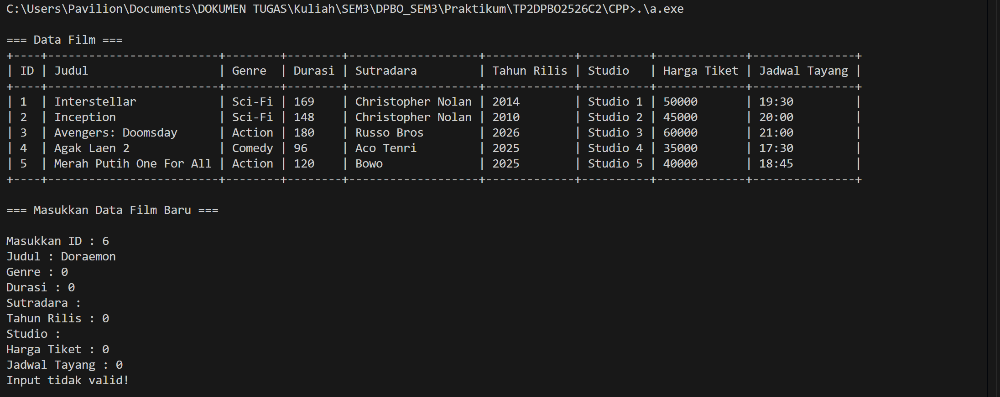

---

### Java
#### 1. Tampilkan Data Film dan Tambahkan Data
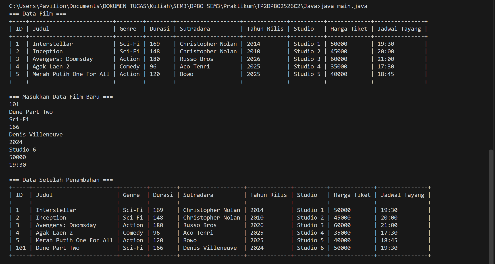

---

#### 2. Eror Handling ID Film
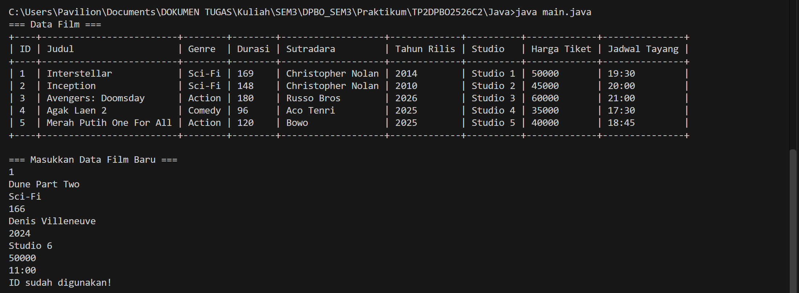

---

#### 3. Eror Handling Input (Input Salah)
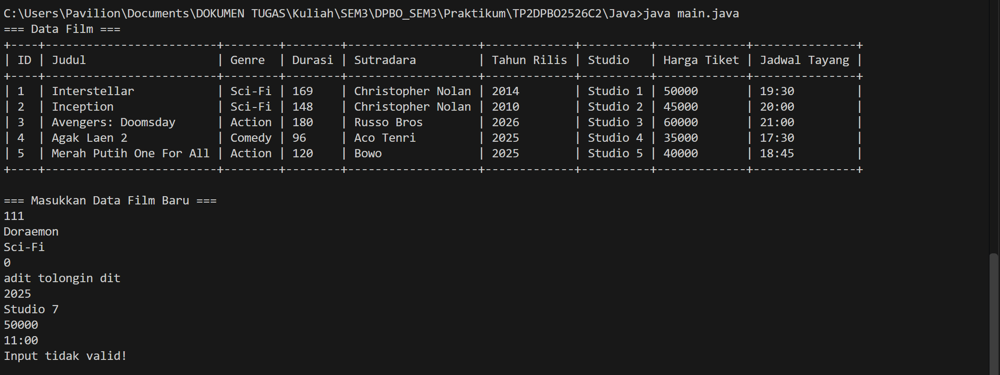

---

### Python
#### 1. Tampilkan Data Film dan Tambahkan Data
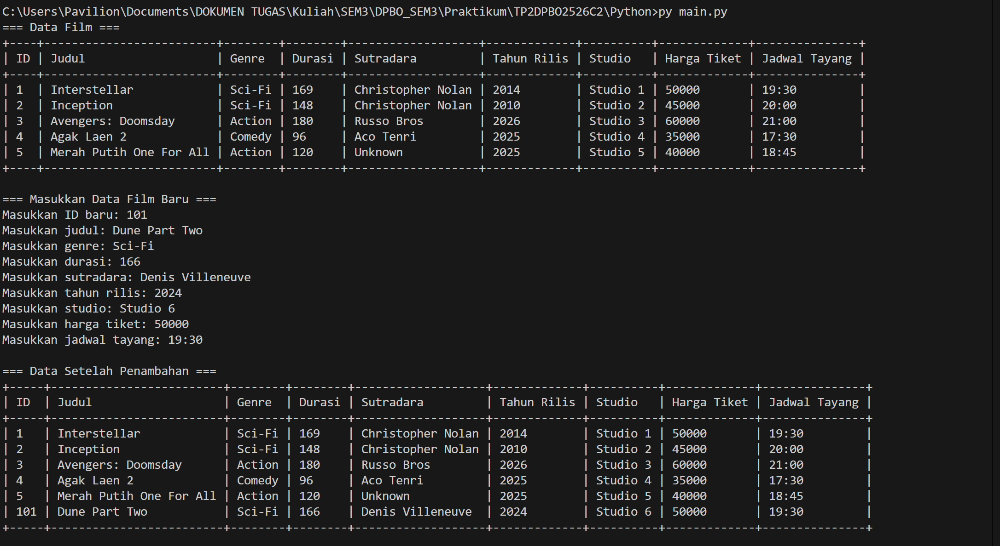

---

#### 2. Eror Handling ID Film
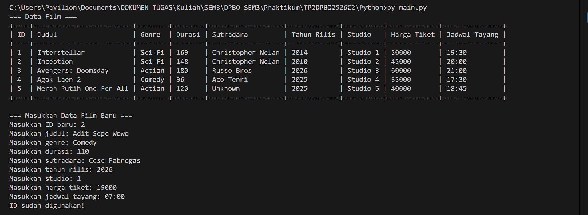

---

#### 3. Eror Handling Input (Input Salah)
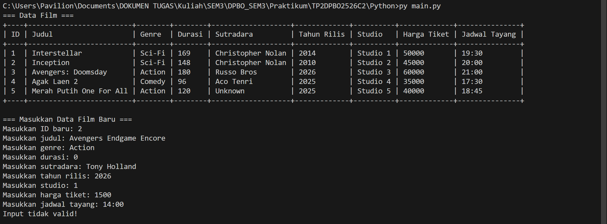

---

### PHP
#### 1. Dashboard
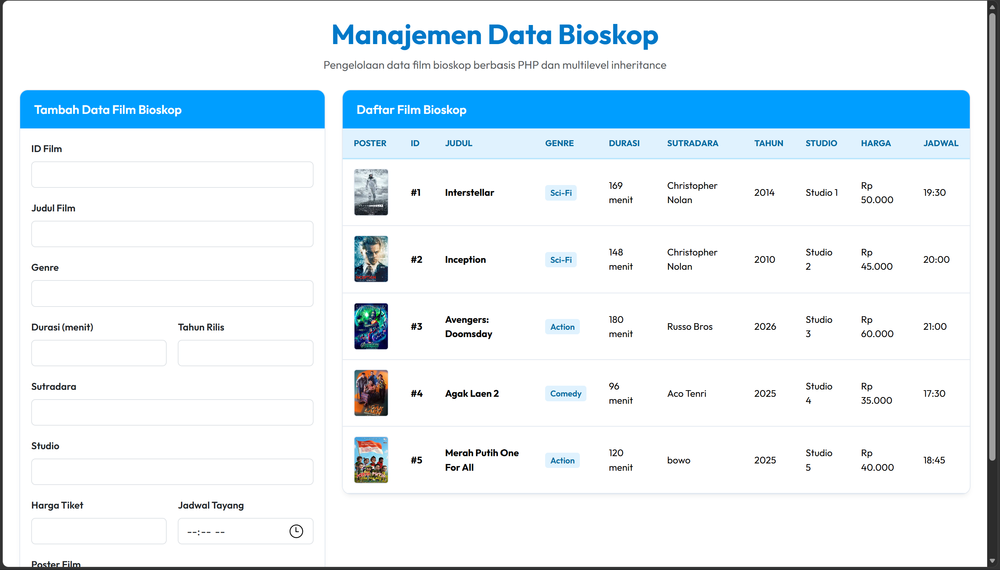

---

#### 2. Tambahkan Film
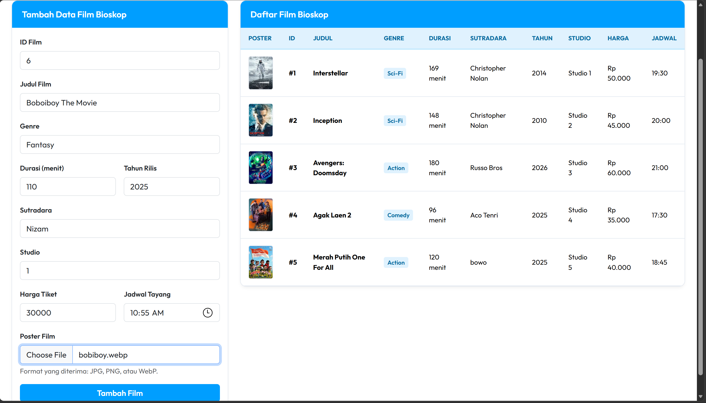
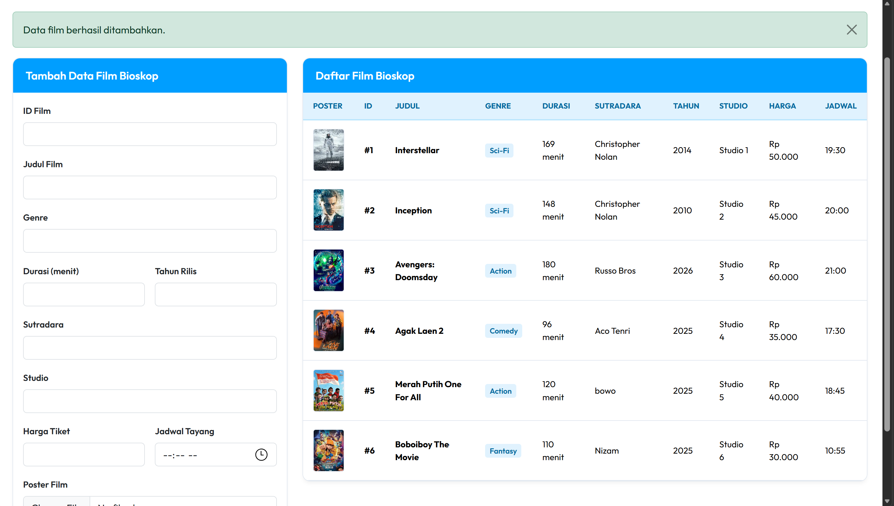

---

#### 3. Eror Handling ID
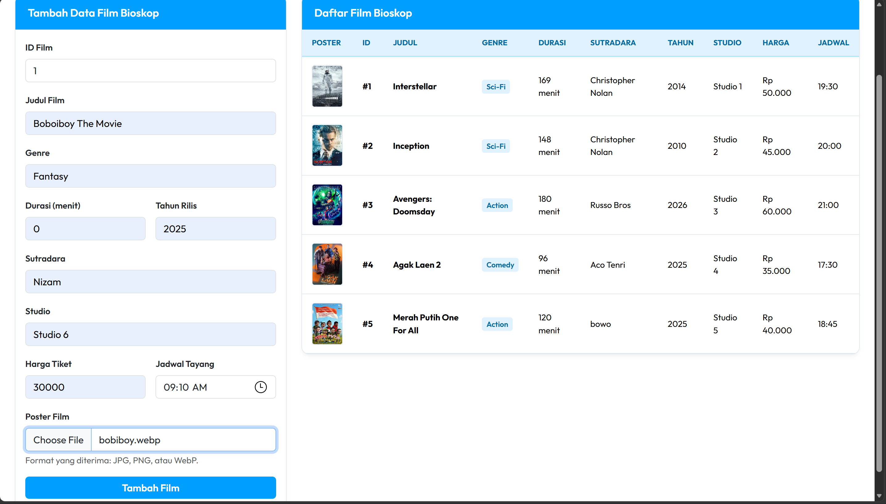
.png)

---

#### 4. Eror Handling Input Film
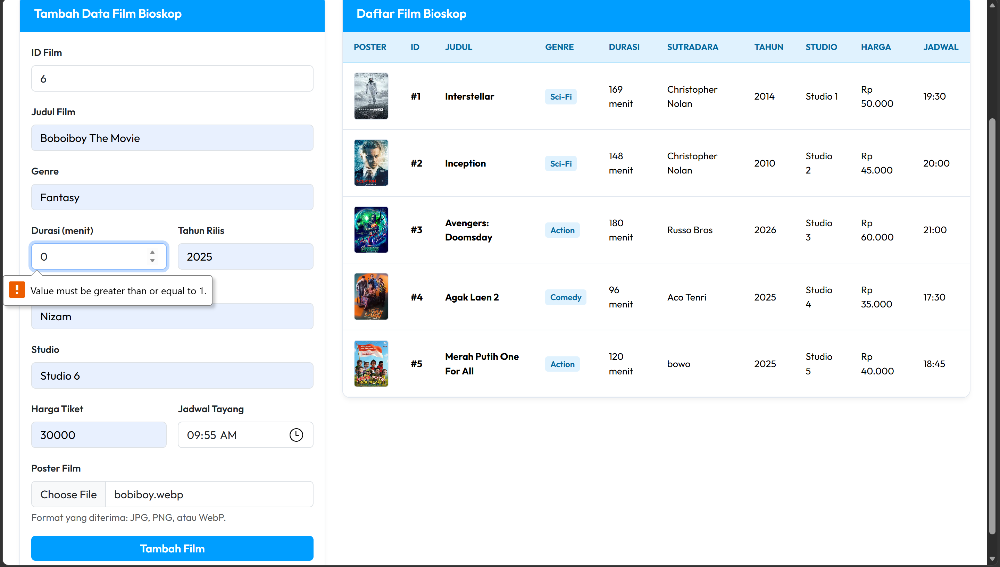

---