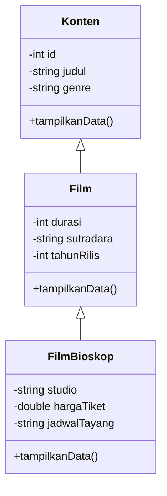

# Implementation Plan TP2 DPBO 2526 C2

## 1. Tema Program

Melanjutkan tema TP1, yaitu **Sistem Manajemen Data Film Bioskop**. Program akan mengelola daftar film yang sedang atau pernah ditayangkan di bioskop.

Program dibuat dalam empat bahasa:

- C++
- Java
- Python
- PHP

Fitur utama yang dibuat adalah menampilkan data awal dan menambahkan data baru dari input user. Fitur update, delete, dan search tidak diperlukan karena ketentuan TP2 hanya meminta fitur Add.

## 2. Desain Multilevel Inheritance

Program menggunakan tiga class dengan hubungan pewarisan bertingkat:



### Class `Konten`

Class dasar untuk menyimpan informasi umum sebuah konten film.

Atribut:

- `id`: identitas unik film.
- `judul`: judul film.
- `genre`: genre film.

Method:

- Constructor.
- Getter dan setter untuk setiap atribut.
- Method untuk mengambil atau menampilkan data dasar.

### Class `Film extends Konten`

Class turunan pertama yang menambahkan informasi khusus film.

Atribut:

- `durasi`: durasi film dalam menit.
- `sutradara`: nama sutradara film.
- `tahunRilis`: tahun film dirilis.

Method:

- Constructor yang memanggil constructor `Konten`.
- Getter dan setter untuk setiap atribut.
- Override method tampilan data dari class `Konten`.

### Class `FilmBioskop extends Film`

Class turunan kedua yang menambahkan informasi penayangan film di bioskop.

Atribut:

- `studio`: nomor atau nama studio.
- `hargaTiket`: harga tiket dalam rupiah.
- `jadwalTayang`: waktu penayangan film.

Method:

- Constructor yang memanggil constructor `Film`.
- Getter dan setter untuk setiap atribut.
- Override method tampilan data dari class `Film`.

Atribut khusus PHP:

- `gambar`: path atau nama file gambar poster film.

Atribut `gambar` hanya digunakan pada implementasi PHP sesuai ketentuan tugas.

## 3. Data Awal

Sebelum menerima input user, setiap program harus membuat minimal lima objek awal dari class `FilmBioskop`.

Contoh data awal:

1. Interstellar
2. Inception
3. Avengers: Doomsday
4. Agak Laen 2
5. Merah Putih One For All

Setiap objek harus memiliki data lengkap dari seluruh class, yaitu data `Konten`, `Film`, dan `FilmBioskop`. Implementasi PHP juga memiliki data gambar.

## 4. Fitur Program

### Fitur wajib

1. Membuat lima objek awal sebelum input user.
2. Menampilkan seluruh data objek awal.
3. Menerima input user untuk menambahkan satu atau lebih data film baru.
4. Menyimpan objek baru ke dalam list, array, vector, atau struktur data yang sesuai.
5. Menampilkan kembali seluruh data setelah penambahan.
6. Menampilkan atribut dari seluruh class dalam satu tabel lengkap.

### Input C++, Java, dan Python

Program menerima input interaktif berupa:

- ID
- Judul
- Genre
- Durasi
- Sutradara
- Tahun rilis
- Studio
- Harga tiket
- Jadwal tayang

### Input PHP

PHP dapat menggunakan data hardcode, tetapi direncanakan menggunakan form HTML untuk menambahkan data melalui website. Form juga menyediakan input gambar poster.

## 5. Validasi Input

Validasi yang akan diterapkan:

- ID tidak boleh kosong.
- ID tidak boleh duplikat.
- Judul, genre, sutradara, studio, dan jadwal tayang tidak boleh kosong.
- Durasi harus lebih besar dari nol.
- Tahun rilis harus berupa angka yang valid.
- Harga tiket tidak boleh negatif.
- Input teks harus dapat menerima spasi.
- PHP memeriksa tipe dan keberadaan file gambar yang diunggah.

## 6. Tampilan Tabel

Seluruh data dari ketiga class harus ditampilkan di dalam satu tabel.

Kolom tabel:

```text
ID | Judul | Genre | Durasi | Sutradara | Tahun Rilis | Studio | Harga Tiket | Jadwal Tayang
```

Ketentuan implementasi tabel:

- C++ menghitung lebar kolom berdasarkan data terpanjang.
- Java menggunakan format kolom dengan `printf` atau perhitungan lebar kolom.
- Python menghitung lebar maksimum setiap kolom.
- PHP menggunakan tabel HTML dan CSS responsif.
- Semua atribut dari `Konten`, `Film`, dan `FilmBioskop` harus ditampilkan.
- PHP juga menampilkan gambar poster pada kolom khusus.

## 7. Rencana Struktur Folder

```text
TP2DPBO2526C2/
├── README.md
├── plan.md
├── CPP/
│   ├── Media.cpp
│   ├── Film.cpp
│   ├── FilmBioskop.cpp
│   ├── main.cpp
│   └── testcase.txt
├── Java/
│   ├── Media.java
│   ├── Film.java
│   ├── FilmBioskop.java
│   ├── Main.java
│   └── testcase.txt
├── Python/
│   ├── Media.py
│   ├── Film.py
│   ├── FilmBioskop.py
│   ├── main.py
│   └── testcase.txt
├── PHP/
│   ├── Media.php
│   ├── Film.php
│   ├── FilmBioskop.php
│   ├── index.php
│   ├── testcase.txt
│   └── images/
└── Dokumentasi/
```

## 8. Format Testcase

Setiap folder bahasa wajib memiliki file `testcase.txt`. Isi testcase mengikuti urutan input program.

Contoh:

```text
101
Dune Part Two
Sci-Fi
166
Denis Villeneuve
2024
Studio 1
50000
19:30
```

Testcase digunakan untuk membuktikan bahwa:

- Input data baru berhasil diproses.
- Input teks yang memiliki spasi berhasil diproses.
- Data baru muncul di tabel.
- Lima data awal tetap ditampilkan.
- Validasi ID duplikat dan angka tidak valid berjalan.

## 9. Tahapan Pengerjaan

### Tahap 1: Persiapan

- Membuat struktur folder TP2.
- Menentukan tema film bioskop.
- Menentukan desain tiga class.
- Membuat diagram relasi class.

### Tahap 2: Implementasi Class

- Membuat class `Konten`.
- Membuat class `Film` sebagai turunan `Konten`.
- Membuat class `FilmBioskop` sebagai turunan `Film`.
- Menambahkan minimal tiga atribut pada setiap class.
- Menambahkan constructor, getter, setter, dan method tampilan.

### Tahap 3: Implementasi Program Utama

- Membuat lima objek awal.
- Menampilkan data awal dalam satu tabel.
- Membuat input untuk menambah data.
- Menerapkan validasi input.
- Menampilkan tabel setelah data baru ditambahkan.

### Tahap 4: Implementasi Empat Bahasa

- C++ menggunakan inheritance dan `vector`.
- Java menggunakan inheritance dan `ArrayList`.
- Python menggunakan inheritance dan `list`.
- PHP menggunakan inheritance dan array atau session serta form HTML.

### Tahap 5: Pengujian

- Menjalankan setiap program dengan testcase.
- Menguji input normal.
- Menguji input yang memiliki spasi.
- Menguji ID duplikat.
- Menguji durasi dan harga tiket yang tidak valid.
- Memastikan lima objek awal selalu tersedia.
- Memastikan semua kolom tampil dalam satu tabel.

### Tahap 6: Dokumentasi

- Mengambil screenshot hasil program setiap bahasa.
- Menyimpan dokumentasi dalam folder `Dokumentasi`.
- Menjelaskan desain class dan alur program di `README.md`.
- Menambahkan diagram class ke README.
- Menjelaskan cara menjalankan keempat implementasi.

## 10. Checklist Sebelum Pengumpulan

- [ ] Repository bernama `TP2DPBO2526C(kelas)`.
- [ ] Repository diatur menjadi Public.
- [ ] Terdapat tiga class dengan multilevel inheritance.
- [ ] Setiap class memiliki minimal tiga atribut.
- [ ] Terdapat lima objek awal pada setiap `main` atau entry point.
- [ ] C++, Java, dan Python dapat menerima input user.
- [ ] PHP memiliki atribut gambar produk atau poster.
- [ ] Seluruh atribut tampil dalam satu tabel lengkap.
- [ ] Terdapat `testcase.txt` pada setiap folder bahasa.
- [ ] Diagram relasi antar class tersedia.
- [ ] `README.md` berisi janji, atribut, method, diagram, alur, cara menjalankan, dan dokumentasi.
- [ ] File `.o`, `.class`, dan file hasil kompilasi tidak disertakan.
- [ ] Tidak melakukan update branch `main` setelah deadline.
- [ ] Repository siap dikumpulkan sebelum 26 September 2026.
